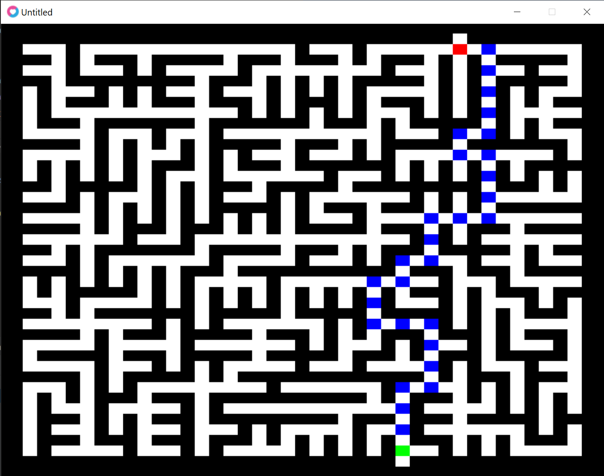

# About

A maze generator and visualizer written in Lua. Displaying the maze is done using [Love2d](https://love2d.org/).



# Running

```shell
$ cd $PATH_TO_CHECKOUT/src
$ lovec --console .
```

- `F5` to generate a new maze
- `s` to show the solution (using BFS this is the shortest)

# Technical

- Algorithm: a randomized version of DFS
- For solving the maze (UI can trace a path), either DFS or BFS is implemented